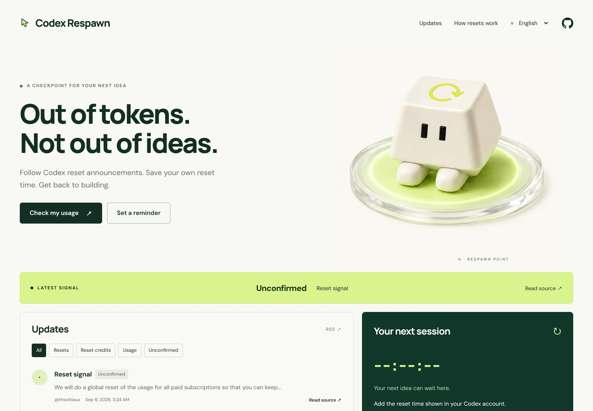

<p align="center"></p>
<h1 align="center">Codex Respawn</h1>
<p align="center"><strong>Out of tokens. Not out of ideas.</strong><br>A checkpoint for your next Codex session.</p>
<p align="center"><a href="https://shixilin.com/ai/codex-reset/">Open the tracker</a> · <a href="https://shixilin.com/ai/codex-reset/feed.xml">RSS</a> · <a href="https://shixilin.com/ai/codex-reset/events.json">Public JSON</a> · <a href="#简体中文">简体中文</a></p>



Codex hits a limit. Your idea doesn't. Respawn brings public reset announcements, their original sources, and your personal reset timer into one small page.

- **See what was actually said.** Announcements, reported completions, reset credits, usage changes and unconfirmed signals are distinct.
- **Keep your own time.** Enter the reset time displayed in your account. Save it locally or download a calendar reminder.
- **Read in nine languages.** English opens by default, with 简体中文, 繁體中文, 日本語, 한국어, Español, Français, Deutsch and العربية available.
- **Follow without another account.** RSS, public JSON and permanent event links are built in.

### What “checked” means

Candidate links come from the public pages of [Codex Reset Monitor](https://codexreset.org/) and [Codex Resets](https://codex-resets.com/), with [CodexRunway](https://www.codexrunway.com/) as a fallback. Their visible text and authors are then checked against **X's official embed endpoint**. These discovery indexes are not treated as evidence. Only allowlisted OpenAI accounts and the Codex lead are accepted.

A truncated post stays **unconfirmed**, even when the visible portion sounds promising. An announcement never becomes a completed reset just because time has passed. “Reported complete” describes the source's statement; it does not verify your account.

The page shows source health and the last successful check. After three hours without a successful check, it marks the data as potentially stale, including in a tab left open. This is a selective announcement feed, not a complete account or service-status monitor. See [OpenAI's usage guidance](https://help.openai.com/en/articles/11369540-using-codex-with-your-chatgpt-plan) for account-specific details.

### Runs on its own

The site, source records, collector and GitHub Actions workflow all live in this repository.

| Job | Schedule | Output |
| --- | --- | --- |
| Announcement check | At minutes 17 and 47 each hour | Verified records, source health, rebuilt site |
| Daily digest | 02:23 UTC daily | A source-linked Markdown digest of the previous UTC day |
| Manual refresh | GitHub Actions → Run workflow | Check, digest and deployment |

GitHub schedules may be delayed. Failures retain existing records and publish the degraded health state. The production workflow requires **no paid API or model**. An optional X API adapter exists in the collector, but paid access is never enabled by default. Subscription OAuth and device credentials do not belong in repository secrets or hosted runners.

For optional editorial review, Grok `grok-4.6` with `high` reasoning can review new public Web/X context through an operator's authorized local subscription CLI. This is separate from the unattended pipeline; no model gets to mark incomplete evidence as confirmed. See [automation notes](docs/automation.md).

### Run locally

Node.js 24 is enough to test, collect and build the site. Published assets are checked in; no package installation is needed for a normal build.

```sh
node --test
node scripts/build.mjs
node scripts/serve.mjs
```

Open `http://127.0.0.1:4187/`. To refresh data, run `node scripts/collect.mjs`. To create a digest, run `node scripts/digest.mjs`.

For image processing or browser checks, install development dependencies with `pnpm install`. `pnpm qa` uses an installed Chrome in headless mode. The timer and calendar export operate locally; no visitor account data is collected by this application.

### Reuse the feed

```sh
curl https://shixilin.com/ai/codex-reset/events.json
```

Each event has a source URL, post ID, type, evidence state, creation and verification timestamps, a short excerpt, truncation flag, provenance, rules version and content hash. A stable post ID is the deduplication key. Details and the trust boundary are in [the data notes](docs/data.md).

Code is MIT-licensed. Fonts retain their own OFL licenses. Source excerpts remain attributable to their authors. The mascot was generated for this project; image provenance is documented in [assets](docs/assets.md).

---

## 简体中文

**额度用完了，灵感还在。** Codex Respawn把公开重置公告、原始来源和个人恢复计时器放在同一页，方便接着把想法做出来。

[打开网站](https://shixilin.com/ai/codex-reset/zh/) · [RSS订阅](https://shixilin.com/ai/codex-reset/feed.xml) · [公开JSON](https://shixilin.com/ai/codex-reset/events.json)

- 区分重置预告、已宣布完成、可用重置次数、额度变化和尚未确认的线索。
- 原文截断就保留为尚未确认，不根据时间推算“已经恢复”。
- 个人计时器使用自己账号显示的时间，可保存到本机或下载日历提醒。
- 默认英文，提供九种语言；网站和自动更新放在同一个开源仓库。
- 每半小时检查公开消息，每天生成来源摘要。调度可能延迟，来源故障和过期状态会在页面显示。

网站无法查看或重置个人账号的实际额度。请以Codex额度面板或CLI中的`/status`为准。日常自动化不需要付费模型，也不会把订阅登录凭据上传到GitHub。

---

Made by [Shixi Lin](https://shixilin.com/?lang=en). For collaborations: [info@elevencapital.ltd](mailto:info@elevencapital.ltd).

If this little checkpoint is useful, you can [support the project](https://shixilin.com/support?lang=en).

Independent project. Not affiliated with OpenAI.
